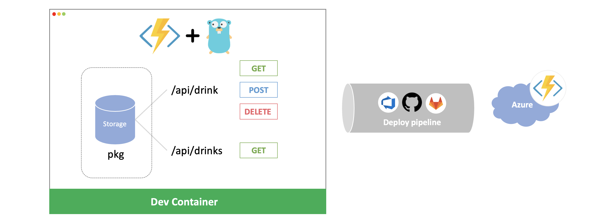

# azure-function-custom-handler-with-golang

This sample shows how to host multiple Azure functions in Golang. To learn more about this sample please check out the full description in [this blog article](https://tosako61.medium.com/multiple-azure-functions-in-golang-aac57c1f25a1).



There is a function "drink" which can be used to create, update, or delete your favorite drink, and a "drinks" method to retrieve all the previously saved drinks.

## How to run this project

It is recommended that you use a [devcontainer](https://code.visualstudio.com/docs/remote/containers).

### Prerequisites

1. [Docker](https://www.docker.com/) is installed and running on your machine
1. [Visual Studio Code](https://code.visualstudio.com/)(VScode) is installed as a code editor

### Launch devcontainer

> ⚠️ Important: AArch64 / arm64 Architecture Notice (24 June 2025)
>
> **Known Issue:**
> The `azure-functions-core-tools` devcontainer feature does **not** work on AArch64 / arm64 architectures due to upstream limitations.
>
> - If you are using an AArch64 / arm64 system, you must **comment out** the `azure-functions-core-tools` feature in your `.devcontainer/devcontainer.json`.
> - However, `azure-functions-core-tools` is still required for local development and running Azure Functions.
> - You will need to **install Azure Functions Core Tools manually** inside your devcontainer (or on your local machine, if not using a devcontainer).
>
> For installation instructions and the latest documentation, see the official repo: [Azure/azure-functions-core-tools](https://github.com/Azure/azure-functions-core-tools)

1. Make sure your docker is running
1. Open this project with VScode
1. Click the green icon in bottom left labelled "Open in Container"

### Build the project

1. Open the terminal in VScode
1. Run `make build`
1. Make sure the `app` file is created the root folder

### Run the project

1. Open the terminal in VScode
1. Run `make start`
1. Comfirm the endpoint URLs appear in the terminal

### Send a HTTP request

1. Sample request for `/drink` endpoint

    ```bash
    ## POST
    curl --location --request POST 'http://localhost:7071/api/drink' \
    --header 'Content-Type: application/json' \
    --data-raw '{
        "name":"Water",
        "price":1
    }'

    ## GET
    curl --location --request GET 'http://localhost:7071/api/drink' \
    --header 'id: <uuid>'

    ## DELETE
    curl --location --request DELETE 'http://localhost:7071/api/drink' \
    --header 'id: <uuid>'
    ```

1. Sample request for `/drinks` endpoint

    ```bash
    ## GET
    curl --location --request GET 'http://localhost:7071/api/drinks'
    ```

### Run unit tests

1. Open the terminal in VScode
1. Run `make test`
1. Run `make coverage`

### Run lint

1. Open the terminal in VScode
1. Run `make lint`

## Deploy

There are two different methods to deploy this project.

### Method 1: Using VSCode

Please follow [Publish the project to Azure](https://docs.microsoft.com/en-us/azure/azure-functions/create-first-function-vs-code-other?tabs=go%2Clinux#publish-the-project-to-azure)

### Method 2: Using a Pipeline

This repo contains yaml pipelines for Github, Azure DevOps and Gitlab. The `pipelines` folder contains the yaml for Github, Azure Pipelines and Gitlab. Please choose the appropriate yaml for your choice of platform.

To deploy this project using a pipeline, you need to set up the Azure Function in Azure yourself in advance.

<details><summary>How to set up a custom handler Azure Function</summary>
<p>

Start by searching for Function App in the Azure Portal and click Create.
The important settings for this are below, other settings you can use default or your own preferences.

[Basic]

1. Publish: Code
1. Runtime stack: Custom Handler
1. Version: custom

[Hosting]

1. Operating System: Linux
1. Plan type: Consumption (Serverless)

</p>
</details>

For some of these inputs it is important to keep them secure, so please consider using an secret management tool or service such as [Azure Key Vault](https://azure.microsoft.com/en-au/services/key-vault/).

#### Github

1. Replace the `.github` folder and its contents with `pipelines/.github`
1. Add credentials in Github secret
   1. [Create a Service Principal](https://github.com/Azure/actions-workflow-samples/blob/master/assets/create-secrets-for-GitHub-workflows.md#set-secret-with-azure-credentials) and [Add the Service Principal in Secrets](https://github.com/Azure/actions-workflow-samples/blob/master/assets/create-secrets-for-GitHub-workflows.md#creating-secrets) as `AZURE_CREDENTIALS`
   1. Add the Azure function name in Secrets as `FUNCTION_APP`

#### Azure DevOps

1. Update variables in `azure-pipelines.yml`
   1. `$(AZURE_SUBSCRIPTION)` with your subscription (format: `subscription_name(subscription_id)`)
   1. `$(FUNCTION_APP)` with the name of your Azure function
1. In Azure DevOps, Navigate to Pipelines > New pipeline
   1. Connect: Azure Repos Git(YAML) option
   1. Select: Your repo
   1. Configure: Existing Azure Pipelines YAML file
   1. Set `main` branch and `/pipeline/azure-pipelines.yml` path
   1. Hit `Run` button. You may see "Permission needed" error at the first time. If you have this error, please grant permission to the subscription.

#### Gitlab

1. In Gitlab, Navigate to Settings > CI/CD
   1. In the General pipelines, put `pipeline/.gitlab-ci.yml` in the CI/CD configuration file textbox.
   1. In Variables, create `APPLICATION_ID`, `APPLICATION_SECRET` and `TENANT_ID` variables. You can find the values in the Azure portal.
1. In the `.gitlab-ci.yml` file
   1. Update the `REPO_NAME` value with your Gitlab repositiory.
   1. Update the `FUNCTION_APP` value in `.gitlab-ci.yml` file with the name of your Azure function.

## Resources

- [Azure Functions custom handlers](https://docs.microsoft.com/en-us/azure/azure-functions/functions-custom-handlers)
- [Standard Go Project Layout](https://github.com/golang-standards/project-layout)
